 

---

## About

Full-Stack Software Developer building scalable web platforms, Web3 systems, and AI-powered automation workflows.

I focus on designing reliable software from architecture to production, combining frontend experiences, backend systems, distributed services, and emerging technologies.

Currently working on:
- Full-stack product development
- Blockchain and Web3 infrastructure
- AI integrations and automation workflows
- Scalable backend architectures

---

## Technology Stack

---

## Engineering Principles

- Build systems that are reliable and maintainable
- Prefer simple architectures that scale
- Focus on product impact, not only code
- Automate repetitive workflows
- Design software with security and reliability in mind

---

## GitHub Activity

 

---

## Contribution Snake

---

## Connect

